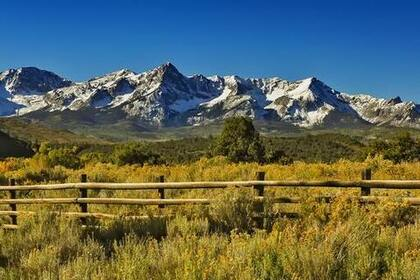
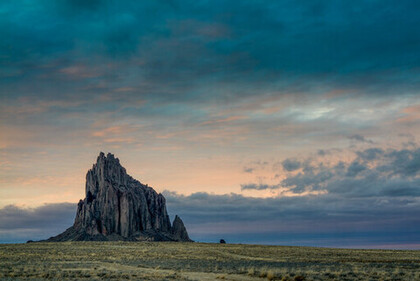

### 图片 Images

要添加图片的话，首先请添加感叹号（!），然后紧跟着是方括号，方括号中可添加备用文本（alt text，即图片显示失败后显示此文本），最后跟着圆括号，圆括号中添加图片资源的路径或 URL。你可以选择在圆括号中的路径或 URL 之后添加标题（即 title 属性）。

```

```

渲染效果如下：




#### 带链接的图片

要为图片添加链接，请先为图片的 Markdown 标记添加一个方括号，然后紧跟着一个圆括号，并在圆括号中添加链接地址。

```
[](https://www.flickr.com/photos/beaurogers/31833779864/in/photolist-Qv3rFw-34mt9F-a9Cmfy-5Ha3Zi-9msKdv-o3hgjr-hWpUte-4WMsJ1-KUQ8N-deshUb-vssBD-6CQci6-8AFCiD-zsJWT-nNfsgB-dPDwZJ-bn9JGn-5HtSXY-6CUhAL-a4UTXB-ugPum-KUPSo-fBLNm-6CUmpy-4WMsc9-8a7D3T-83KJev-6CQ2bK-nNusHJ-a78rQH-nw3NvT-7aq2qf-8wwBso-3nNceh-ugSKP-4mh4kh-bbeeqH-a7biME-q3PtTf-brFpgb-cg38zw-bXMZc-nJPELD-f58Lmo-bXMYG-bz8AAi-bxNtNT-bXMYi-bXMY6-bXMYv)
```

渲染效果如下：

[](https://www.flickr.com/photos/beaurogers/31833779864/in/photolist-Qv3rFw-34mt9F-a9Cmfy-5Ha3Zi-9msKdv-o3hgjr-hWpUte-4WMsJ1-KUQ8N-deshUb-vssBD-6CQci6-8AFCiD-zsJWT-nNfsgB-dPDwZJ-bn9JGn-5HtSXY-6CUhAL-a4UTXB-ugPum-KUPSo-fBLNm-6CUmpy-4WMsc9-8a7D3T-83KJev-6CQ2bK-nNusHJ-a78rQH-nw3NvT-7aq2qf-8wwBso-3nNceh-ugSKP-4mh4kh-bbeeqH-a7biME-q3PtTf-brFpgb-cg38zw-bXMZc-nJPELD-f58Lmo-bXMYG-bz8AAi-bxNtNT-bXMYi-bXMY6-bXMYv)