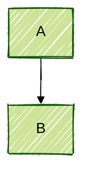
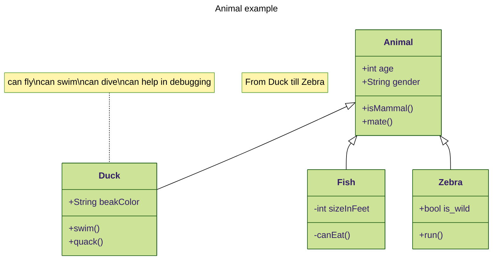

pandoc input.md --filter mermaid-filter -o output.pdf --pdfengine=xelatex

```mermaid
---
config:
  theme: dark
  look: handDrawn
  flowchart:
    curve: smooth
    htmlLabels: true
---
graph LR
  Start --> Process --> End
```

```mermaid
---
config:
  theme: forest
  fontFamily: "Arial"
  look: handDrawn
---
graph TD
  A --> B
```

```mermaid
---
title: Animal example
config:
  theme: forest
  themeVariables:
    primaryColor: "#00ff00"
---
classDiagram
    note "From Duck till Zebra"
    Animal <|-- Duck
    note for Duck "can fly\ncan swim\ncan dive\ncan help in debugging"
    Animal <|-- Fish
    Animal <|-- Zebra
    Animal : +int age
    Animal : +String gender
    Animal: +isMammal()
    Animal: +mate()
    class Duck{
        +String beakColor
        +swim()
        +quack()
    }
    class Fish{
        -int sizeInFeet
        -canEat()
    }
    class Zebra{
        +bool is_wild
        +run()
    }
```